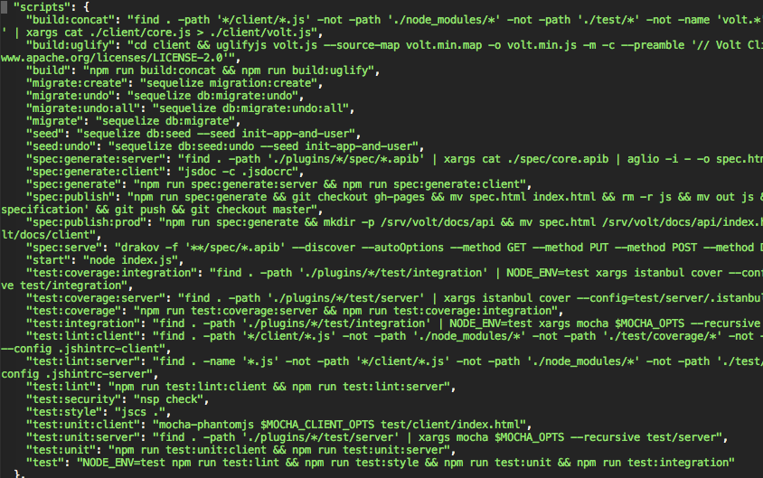

# nabs
## (not another build system)

Writing npm scripts in style


## Who I Am

* <!-- .element: class="fragment" data-fragment-index="1" --> James Kruth - owner of [Ars Mentis](https://www.arsmentis.com) Custom Software and IT Consulting
* First node application written in 2011 <!-- .element: class="fragment" data-fragment-index="2" -->
* Self-confessed build system aficionado and yak shaver <!-- .element: class="fragment" data-fragment-index="3" -->


## Build System Aficionado?


 <!-- .element: class="plain" -->


 <!-- .element: class="plain" -->


## Broccoli.js

 <!-- .element: class="plain" -->


 <!-- .element: class="plain" -->


 <!-- .element: class="plain" -->


## GNU Make

(too cool for a logo)


## But wait, there's more!

* Rake <!-- .element: class="fragment" data-fragment-index="1" -->
* Invoke (pyInvoke) <!-- .element: class="fragment" data-fragment-index="2" -->
* Cake (CoffeeScript is so 2014) <!-- .element: class="fragment" data-fragment-index="3" -->


## Stop the Madness

* Skills don't transfer between systems <!-- .element: class="fragment" data-fragment-index="1" -->
* Too many dependencies <!-- .element: class="fragment" data-fragment-index="2" -->
* Build systems shouldn't denote tooling <!-- .element: class="fragment" data-fragment-index="3" -->


## NPM Scripts!


## Fewer Dependencies

* <!-- .element: class="fragment" data-fragment-index="1" --> Forget all those `grunt-*` or `gulp-*` packages
* You're already using npm (or yarn) <!-- .element: class="fragment" data-fragment-index="2" -->


## Transferable Skills

* Most tools have command line utilities <!-- .element: class="fragment" data-fragment-index="1" -->
* Writing wrappers is a useful skill for those that don't <!-- .element: class="fragment" data-fragment-index="2" -->
* Increasing command line fu can lead to unix moments... <!-- .element: class="fragment" data-fragment-index="3" -->


## Reference

* <https://docs.npmjs.com/misc/scripts>
* <https://www.keithcirkel.co.uk/how-to-use-npm-as-a-build-tool/>
* <https://medium.freecodecamp.com/why-i-left-gulp-and-grunt-for-npm-scripts-3d6853dd22b8>
* <https://css-tricks.com/why-npm-scripts/>


## and they all lived happily ever after!

(world's shortest lightning talk)


## er... maybe not

* JSON is for machines <!-- .element: class="fragment" data-fragment-index="1" -->
* After a few months in npm land... <!-- .element: class="fragment" data-fragment-index="2" -->





## Commence Yak Shaving!


## Introducing Nabs

* A simple YAML to package.json compiler
* <https://github.com/artlogic/nabs>
* `npm install -g nabs`


## How to use

* Make a `nabs.yml` in your project root that defines your tasks <!-- .element: class="fragment" data-fragment-index="1" -->
* Run `nabs` <!-- .element: class="fragment" data-fragment-index="2" -->
* Run your npm tasks like always: `npm run test:unit` <!-- .element: class="fragment" data-fragment-index="3" -->


## Defining Tasks

What's the story with that nabs.yml file, anyway?


## A Simple Example

`package.json`:
```json
"scripts": {
  "lint": "eslint .",
  "minify": "uglifyjs js/main.js -o js/main.min.js"
}
```


## Quoting

`nabs.yml`:
```yaml
lint: eslint .
minify: uglifyjs js/main.js -o js/main.min.js
```


## Comments

`nabs.yml`:
```yaml
# clean code is happy code
lint: eslint .

# minify the build products
minify: uglifyjs js/main.js -o js/main.min.js
```


## A Less Simple Example

`package.json`:
```json
"scripts": {
  "test": "npm run test:client && npm run test:server",
  "test:server": "mocha --recursive test/server",
  "test:client": "mocha --recursive test/client",
  "spec": "npm run spec:generate && npm run spec:publish",
  "spec:generate": "jsdoc -c .jsdocrc",
  "spec:publish": "npm run spec:generate && rm prod && mv out prod"
}
```


## Nested Tasks

`nabs.yml`:
```yaml
# in soviet russia code tests you!
test:
  server: mocha --recursive test/server
  client: mocha --recursive test/client

# generate some docs
spec:
  generate: jsdoc -c .jsdocrc
  publish: npm run spec:generate && rm prod && mv out prod
```


## Multi-action Tasks

`nabs.yml`:
```yaml
# in soviet russia code tests you!
test:
  server: mocha --recursive test/server
  client: mocha --recursive test/client

# generate some docs
spec:
  generate: jsdoc -c .jsdocrc
  publish:
    - npm run spec:generate
    - rm prod
    - mv out prod
```


## Dependencies

`nabs.yml`:
```yaml
# in soviet russia code tests you!
test:
  server: mocha --recursive test/server
  client: mocha --recursive test/client

# generate some docs
spec:
  generate: jsdoc -c .jsdocrc
  publish:
    $depend: spec:generate  # could be a YAML sequence
    $action:
      - rm prod
      - mv out prod
```


## Defaults

Parent tasks have a default `$action` and `$depend` values:

* <!-- .element: class="fragment" data-fragment-index="1" --> `$action` is empty
* <!-- .element: class="fragment" data-fragment-index="2" --> `$depend` is the list of child tasks in *alphabetical* order


## A Contrived Example...

`package.json`:
```json
"scripts": {
  "migrate:create": "sequelize migration:create",
  "migrate:undo": "sequelize db:migrate:undo",
  "migrate": "sequelize db:migrate"
}
```


## Overriding Defaults

`nabs.yaml`:
```yaml
migrate:
  $depend: []
  $action: sequelize db:migrate

  # child tasks
  create: sequelize migration:create
  undo: sequelize db:migrate:undo
```


## Future Features?

* <!-- .element: class="fragment" data-fragment-index="1" --> Support for [scripty](https://www.npmjs.com/package/scripty)-like tasks
* File globbing support <!-- .element: class="fragment" data-fragment-index="2" -->
* Parallel tasks <!-- .element: class="fragment" data-fragment-index="3" -->
* Watch for changes <!-- .element: class="fragment" data-fragment-index="4" -->
* Ideas? Let me know! <!-- .element: class="fragment" data-fragment-index="5" -->


# Questions?


# Thanks!

* Nabs
  * <https://github.com/artlogic/nabs>
  * <https://www.npmjs.com/package/nabs>
* NPM as a task runner:
  * <https://docs.npmjs.com/misc/scripts>
  * <https://www.keithcirkel.co.uk/how-to-use-npm-as-a-build-tool/>
  * <https://medium.freecodecamp.com/why-i-left-gulp-and-grunt-for-npm-scripts-3d6853dd22b8>
  * <https://css-tricks.com/why-npm-scripts/>
